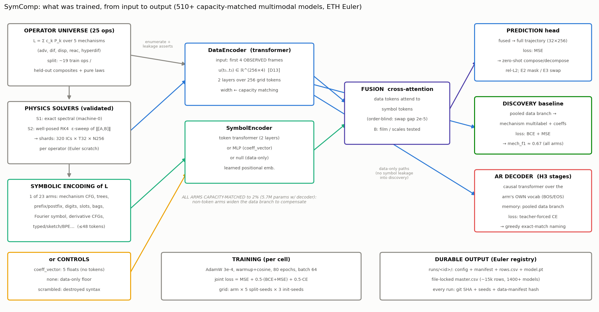
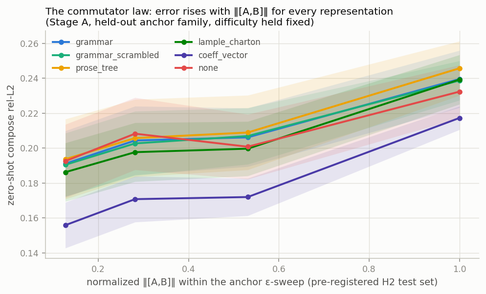
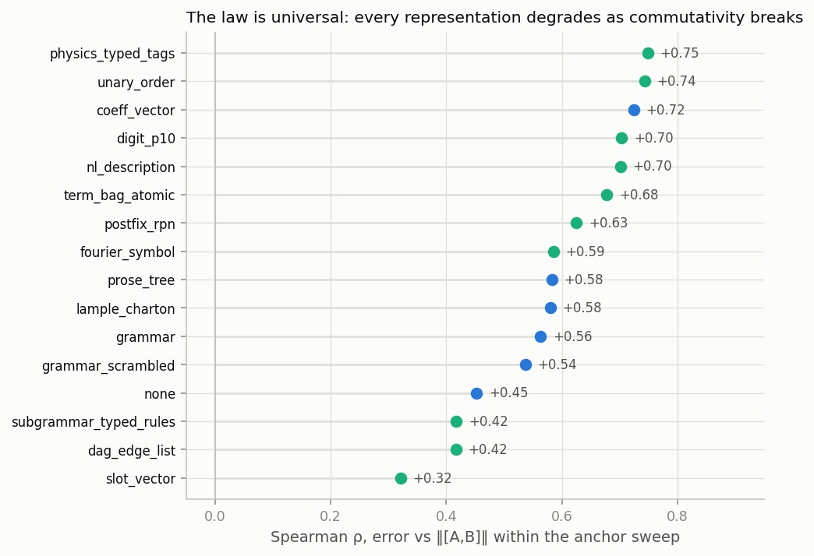
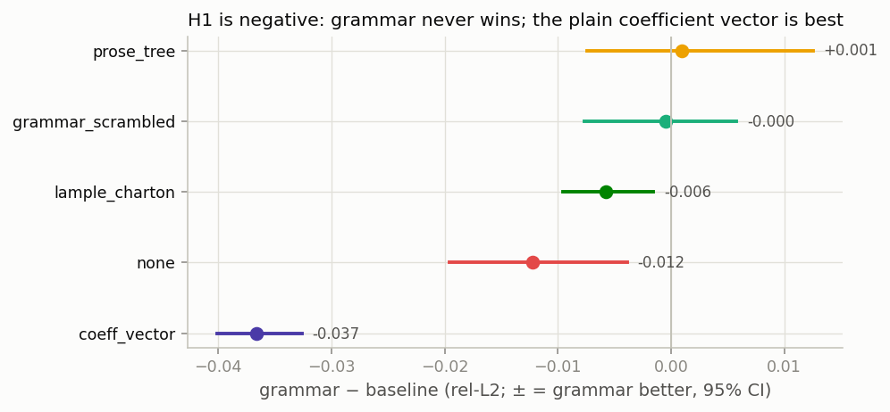
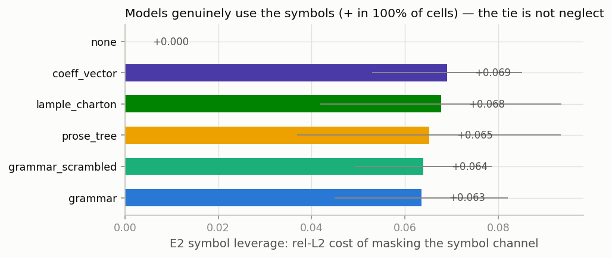
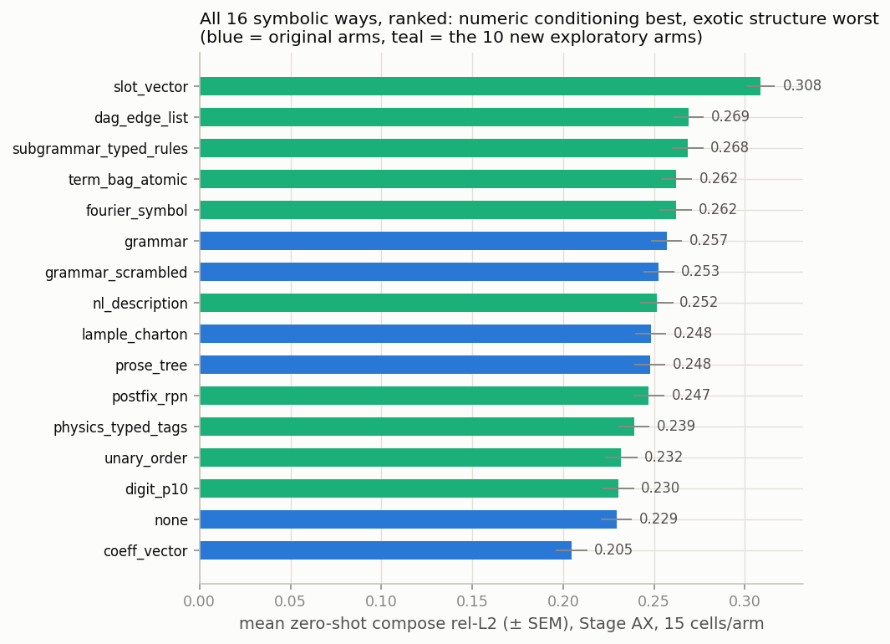
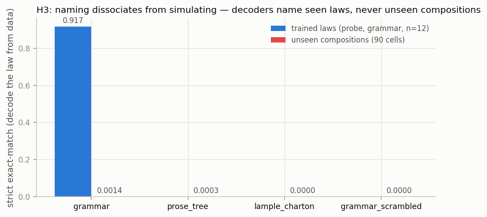
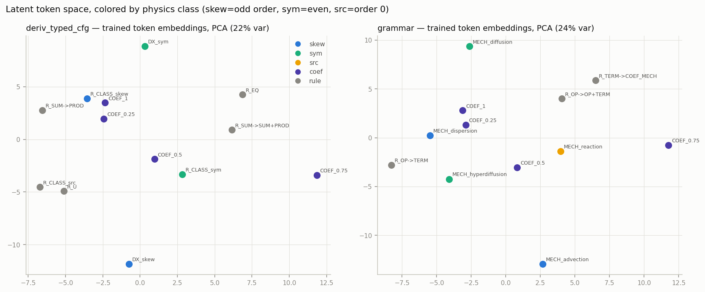
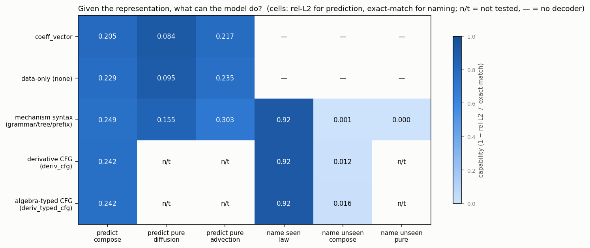

# SymComp — Meeting Deck (2026-07-08)

*(One section per slide; all numbers from the frozen Euler CSVs; nothing
illustrative. Presenter notes in italics.)*

---

## 1 · The question

**Does a grammar-structured symbolic representation of a PDE operator, trained
jointly with numerical data, compose better zero-shot than flat symbols?**

- Train: pure advection, pure diffusion (and friends), separately
- Test: advection+diffusion — never seen — both *predict it* and *name it*
- Pre-registered H1–H5, capacity-matched to 2%, hostile-referee-first design

*Notes: one month ago this was a scaffold; every claim tonight has a CI.*

---

## 2 · What we built

- 23 representations (6 pre-registered + 17 designed exploratory arms)
- ~2,100 trained multimodal models on Euler; every run reproducible
- Interventions: masking, counterfactual swaps, order swaps, decoders

---

## 3 · Headline: the commutator law (H2 ✓)

Zero-shot error rises with ‖[A,B]‖ — **in every representation** (ρ +0.32…+0.75).
Symbols carry the generator; no syntax encodes the BCH correction.

---

## 4 · The law is representation-independent

*Notes: 16 arms, incl. semantic (Fourier-symbol) tokens. Nothing escapes.*

---

## 5 · H1 is negative — and it's the strong form

- Grammar never wins; **coefficient vector best everywhere**; scrambled ties
- Models demonstrably USE symbols (masking +0.06–0.08, 100% of cells;
  counterfactuals steer ~30%) — the tie is real, not neglect
- Replicated ×2; survives fusion/scale; FiLM *collapses* token arms (0.43)
  while vectors sail (0.21) — token reading is the fragile part

---

## 6 · Every symbolic way, ranked

*Notes: numeric-flavored conditioning top, exotic structure bottom;
order-blindness measured at 2×10⁻⁴ across 330 checkpoints.*

---

## 7 · Naming ≠ simulating (H3)

- Decoders name **seen** laws near-perfectly (0.92)
- Name **unseen compositions**: ≈0 in every mechanism-level syntax,
  both directions (compose AND mixture→pure)
- The same models *predict* those compositions at rel-L2 0.2–0.3

---

## 8 · The one thing that moved naming — replicated ×3

Derivative-level grammars (advection *is* c·∂x u — shared substructure):

| level | best arm | naming |
|---|---|---|
| mechanism words (L&C/PROSE style) | all | 0.000–0.003 |
| unrolled-dx vocabulary | infix/unary | 0.005–0.008 |
| unrolled-dx **CFG** | deriv_cfg | 0.006–0.012 |
| **algebra-typed CFG** | deriv_typed_cfg | **0.014–0.018** |

Parsimony factorial: aligned chunking OK; statistical BPE (control,
pre-registered to lose) didn't win; plan-first + unary numerals hurt.

---

## 9 · H5 confirmed: the singular limit is harder

Train on mixtures only → recover pure laws (prediction):
**diffusion 0.08–0.17** (regular limit) vs **advection 0.22–0.31** (singular),
2–3× gap, all six arms. Naming the pure laws: 0.000.

---

## 10 · Inside the model

*Notes: token embeddings organize by physics class in the typed model;
capability matrix = what's predictable given what, per arm family.*

---

## 11 · The constructive result (Stage BEST)

**Numbers in, grammar out** — decoupled conditioning/naming:

| arm | prediction | naming |
|---|---|---|
| coeff_vector @ typed-CFG | **0.211** | **0.0139** |
| coeff_vector alone | 0.203 | — |
| typed-CFG both ways | 0.257 | 0.0168 |

One capacity-matched model, both optima; every ingredient traceable to a
measured result.

---

## 12 · Asks

1. **Scaling scope:** coefficient ranges → nonlinear/2D → model scale
   (in that evidence-first order)?
2. **Write-up:** target venue + framing sign-off ("laws of the symbolic
   lane"); prior-art re-check running, novelty statement to follow
3. Disclosures we'll make: exact-match strictness, fixed coefficients so
   far, 1D linear universe, minor run blemishes (all logged)
